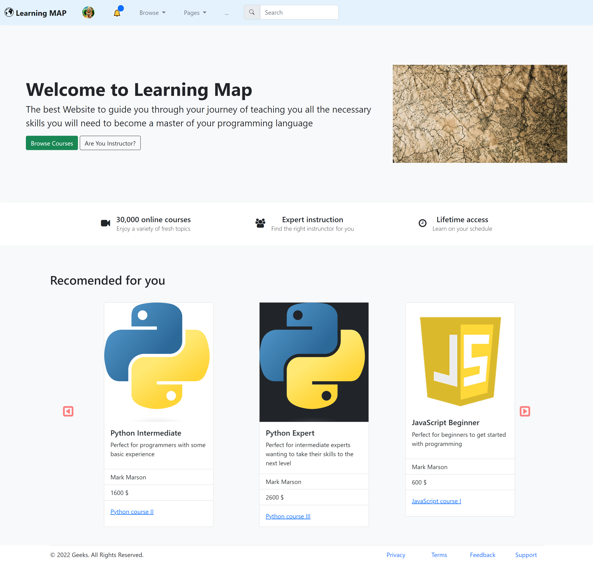

# Learning_Map - Webpage
Learning Map - Webpage was developed using Bootstrap 5, HTML and some inline CSS.
It's a simple webpage depicting a template for the main page of a learning webpage.
Its main features are: navbar, jumbotron, flex, grid system, cards, carousel slides.
This interactive webpage was made responsive to look nice on mobile devices 
and desktops. 

**Examples View:** 

***The home page.*** 
 
